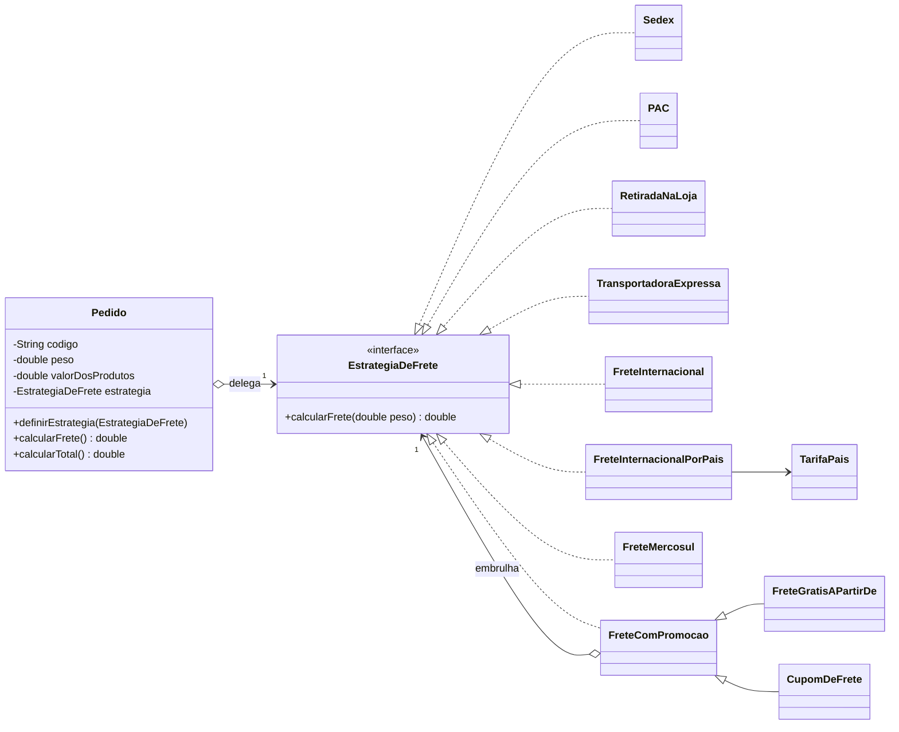

# Exercício 02: Strategy no cálculo de frete

> Métodos Avançados de Programação (UEPB, 2026.2) · Autor: Pedro Santos · Java 17+

Enunciado da atividade: [`enunciado.pdf`](enunciado.pdf) · Respostas discursivas: [`RESPOSTAS.md`](RESPOSTAS.md)

## O problema

A classe `Pedido` original decidia o valor do frete com uma cadeia de `if/else` comparando uma `String` (`"SEDEX"`, `"PAC"`...). Isso fazia o `Pedido` conhecer todas as tabelas de frete da loja. A cada modalidade nova era preciso reabrir e modificar essa classe, e um erro de digitação no nome do frete só aparecia em tempo de execução, além disso a complexidade do código é aumentada, por está em um estrutura de `if/else` , sendo prejudicial para a manutenção.

## A solução

Cada fórmula virou uma classe que implementa a interface `EstrategiaDeFrete`. O `Pedido` guarda uma referência para essa interface e delega a ela o cálculo, sem saber qual modalidade está usando.

| Papel no Strategy      | Classe                                                                                     |
| ---------------------- | ------------------------------------------------------------------------------------------ |
| Strategy               | `estrategia/EstrategiaDeFrete`                                                           |
| Estratégias concretas | `Sedex`, `PAC`, `RetiradaNaLoja`, `TransportadoraExpressa`, `FreteInternacional` |
| Context                | `pedido/Pedido`                                                                          |



## Além do mínimo pedido

- **Questão 4 em código.** Países que só diferem nos valores usam uma única estratégia, `FreteInternacionalPorPais`, alimentada por uma tabela (`TabelaTarifasInternacionais` + `record TarifaPais`). Um destino com fórmula própria, `FreteMercosul` (regra fictícia), ganha classe própria.
- **Desafio extra com Decorator.** `FreteComPromocao` implementa a mesma interface e embrulha uma modalidade. `FreteGratisAPartirDe` e `CupomDeFrete` ajustam o valor sem que Sedex, PAC etc. sejam alterados, e as promoções podem ser combinadas.
- **Verificação automática.** `app/Verificacao` confere se os valores da refatoração são idênticos aos do código original com `if/else`, além dos casos-limite (compra de exatamente R$ 399, cupom maior que o frete, estratégia nula).
- **Pedido mais completo.** Código, valor dos produtos, `calcularTotal()` e validação de peso e estratégia.

## Estrutura

```
src/br/uepb/map/frete/
├── app/
│   ├── Main.java                  demonstração
│   └── Verificacao.java           conferência dos resultados
├── pedido/
│   └── Pedido.java                Context
├── estrategia/
│   ├── EstrategiaDeFrete.java     Strategy
│   ├── Sedex.java  PAC.java  RetiradaNaLoja.java
│   ├── TransportadoraExpressa.java  FreteInternacional.java
│   └── internacional/
│       ├── TarifaPais.java  TabelaTarifasInternacionais.java
│       ├── FreteInternacionalPorPais.java
│       └── FreteMercosul.java
└── promocao/
    ├── FreteComPromocao.java      Decorator base
    ├── FreteGratisAPartirDe.java
    └── CupomDeFrete.java
```

## Saída do programa

```

Pedido PED-001 | 10 kg | produtos R$ 250,00
-----------------------------------------------------------------
Sedex                                                    R$ 70,00
PAC                                                      R$ 30,00
Retirada na loja                                          R$ 0,00
Transportadora Expressa                                 R$ 120,00
Internacional (regra nova)                              R$ 145,00

Internacional por destino (valores ilustrativos)
-----------------------------------------------------------------
EUA                                                     R$ 145,00
PORTUGAL                                                R$ 190,00
JAPAO                                                   R$ 240,00
MERCOSUL (fórmula própria)                               R$ 95,00

Promoções sobre as modalidades existentes
-----------------------------------------------------------------
Sedex + grátis a partir de R$ 399 (compra R$ 250)        R$ 70,00
PAC + grátis a partir de R$ 399 (compra R$ 520)           R$ 0,00
Transportadora + cupom de R$ 30                          R$ 90,00
Internacional + grátis R$ 399 + cupom R$ 45             R$ 100,00

Total do PED-002 com a última estratégia: R$ 350,00
```

As respostas das questões discursivas estão em [`RESPOSTAS.md`](RESPOSTAS.md).

## Referências

|                                                                            |                                                                                                          |                                                                                                  |                                                              |                                                            |
| :-------------------------------------------------------------------------: | :------------------------------------------------------------------------------------------------------: | :-----------------------------------------------------------------------------------------------: | :-----------------------------------------------------------: | :--------------------------------------------------------: |
|                                                                            |                                                                                                          |                                                                                                  |                                                              |                                                            |
| [Padrões de Projeto](https://loja.grupoa.com.br/padroes-de-projeto-p989759) | [Use a Cabeça! Padrões de Projetos](https://altabooks.com.br/produto/use-a-cabeca-padroes-de-projetos/) | [Utilizando UML e Padrões](https://loja.grupoa.com.br/utilizando-uml-e-padroes-3ed-ebook-p988162) | [Java Efetivo](https://altabooks.com.br/produto/java-efetivo/) | [Refatoração](https://novatec.com.br/livros/refatoracao/) |
|               Gamma, Helm, Johnson e Vlissides. Bookman, 2000               |                                  Freeman e Freeman. Alta Books, 2ª ed.                                  |                                     Larman. Bookman, 3ª ed.                                     |               Bloch. Alta Books, 3ª ed., 2019               |                  Fowler. Novatec, 2ª ed.                  |

**Referências online (sem capa):**

- [Strategy (Refactoring.Guru)](https://refactoring.guru/pt-br/design-patterns/strategy)
- [Decorator (Refactoring.Guru)](https://refactoring.guru/pt-br/design-patterns/decorator)
- [Substituir Condicional por Polimorfismo](https://refactoring.guru/pt-br/replace-conditional-with-polymorphism)
- [The Open-Closed Principle, Robert C. Martin (1996)](https://www.cs.utexas.edu/~downing/papers/OCP-1996.pdf)
- [JEP 395: Records](https://openjdk.org/jeps/395)
- [Pro Git, em português](https://git-scm.com/book/pt-br/v2)
