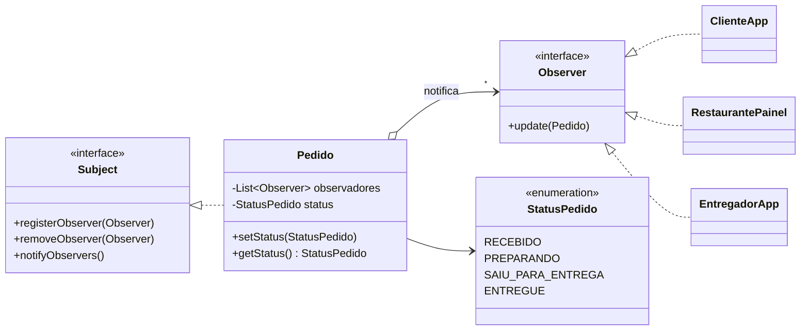
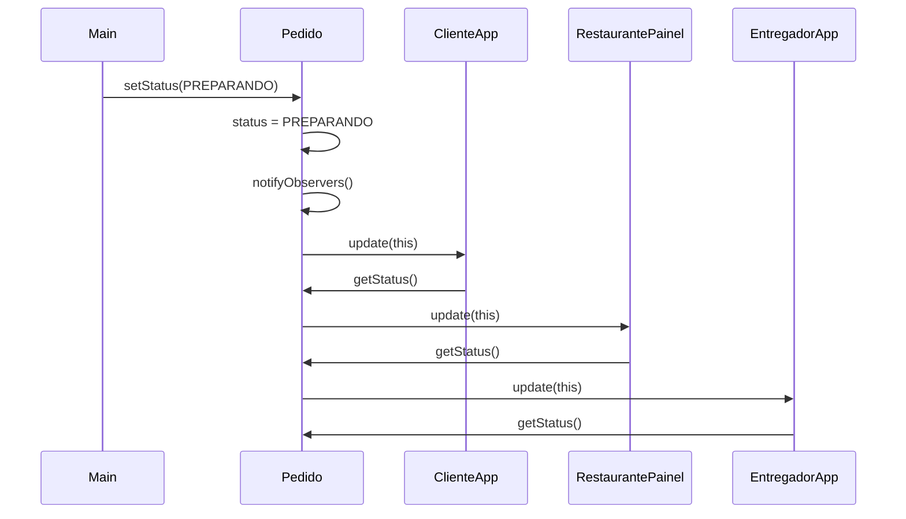

# Exercício: Observer no acompanhamento de pedidos (estilo iFood)

> Métodos Avançados de Programação (UEPB, 2026.2) · Autor: Pedro Santos · Java 17+

Enunciado: [`enunciado.pdf`](enunciado.pdf)

## O problema

Num app de delivery, cada mudança de status do pedido interessa a várias partes: o cliente, o restaurante e o entregador. Se o `Pedido` chamasse cada uma delas diretamente, ele ficaria preso a todas. Para incluir um novo interessado (um painel de suporte, um serviço de SMS), seria preciso alterar o `Pedido`.

## A solução

Com o padrão **Observer**, o `Pedido` (Subject) mantém uma lista de `Observer` e, a cada `setStatus`, avisa todos eles pelo método `update`. O pedido não sabe **quem** está ouvindo, apenas que são objetos com um `update`. Os interessados entram e saem da lista em tempo de execução.

| Papel no Observer      | Classe                                                   |
| ---------------------- | -------------------------------------------------------- |
| Subject                | `contrato/Subject`                                     |
| Observer               | `contrato/Observer`                                    |
| Subject concreto       | `pedido/Pedido`                                        |
| Observadores concretos | `ClienteApp`, `RestaurantePainel`, `EntregadorApp` |
| Estado observado       | `pedido/StatusPedido` (enum)                           |



### O que acontece em um `setStatus`



## Decisões de implementação

- **Modelo "pull".** O `update` recebe o próprio `Pedido`, e cada observador consulta `getStatus()`. Assim, se o pedido ganhar novas informações (tempo estimado, endereço), a interface `Observer` não precisa mudar.
- **Notificação sobre uma cópia da lista.** O `notifyObservers` percorre `List.copyOf(observadores)`. Um observador pode se remover durante o aviso sem causar `ConcurrentModificationException`.
- **Sem registro duplicado.** O mesmo observador registrado duas vezes receberia a notificação em dobro, então o `registerObserver` ignora repetições e recusa `null`.
- **Status inicial `RECEBIDO`.** Todo pedido nasce recebido; as mudanças seguintes disparam as notificações.
- **`setStatus` segue o enunciado à risca.** Ele sempre atualiza e notifica, mesmo que o status repetido seja igual ao atual. Uma variação comum seria notificar só quando o valor realmente mudar.
- **Interfaces próprias.** O Java já teve `java.util.Observer`/`Observable`, mas eles estão *deprecated* desde o Java 9. Por isso, e porque o enunciado pede, as interfaces foram criadas no projeto.

## Extras

- **`app/DemonstracaoRemocao`** usa o `removeObserver`: depois que o pedido sai da cozinha, o restaurante deixa de acompanhar. Também registra um observador novo (suporte) criado com *lambda*, sem criar classe nem alterar o `Pedido`.
- **`app/Verificacao`** executa o `Main`, captura o console e compara linha a linha com a saída esperada do enunciado. Também testa registro duplicado, remoção e observador nulo.

## Estrutura

```
src/br/uepb/map/observer/
├── contrato/        Subject.java, Observer.java
├── pedido/          Pedido.java, StatusPedido.java
├── observadores/    ClienteApp.java, RestaurantePainel.java, EntregadorApp.java
└── app/             Main.java, DemonstracaoRemocao.java, Verificacao.java
```

## Saída do `Main`

```
Cliente recebeu notificação: Pedido está PREPARANDO
Restaurante recebeu atualização: Pedido está PREPARANDO
Entregador recebeu atualização: Pedido está PREPARANDO
Cliente recebeu notificação: Pedido está SAIU_PARA_ENTREGA
Restaurante recebeu atualização: Pedido está SAIU_PARA_ENTREGA
Entregador recebeu atualização: Pedido está SAIU_PARA_ENTREGA
Cliente recebeu notificação: Pedido está ENTREGUE
Restaurante recebeu atualização: Pedido está ENTREGUE
Entregador recebeu atualização: Pedido está ENTREGUE
```

## Referências

|                                                                            |                                                                                                          |                                                                                                  |                                                              |
| :-------------------------------------------------------------------------: | :------------------------------------------------------------------------------------------------------: | :-----------------------------------------------------------------------------------------------: | :-----------------------------------------------------------: |
|                                                                            |                                                                                                          |                                                                                                  |                                                              |
| [Padrões de Projeto](https://loja.grupoa.com.br/padroes-de-projeto-p989759) | [Use a Cabeça! Padrões de Projetos](https://altabooks.com.br/produto/use-a-cabeca-padroes-de-projetos/) | [Utilizando UML e Padrões](https://loja.grupoa.com.br/utilizando-uml-e-padroes-3ed-ebook-p988162) | [Java Efetivo](https://altabooks.com.br/produto/java-efetivo/) |
|                        Gamma et al. Padrão Observer                        |                                   Freeman e Freeman. Cap. 2 (Observer)                                   |                               Larman. Observer (Publish-Subscribe)                               |           Bloch. Item 79 (exemplo com observadores)           |

- [Observer (Refactoring.Guru)](https://refactoring.guru/pt-br/design-patterns/observer)
