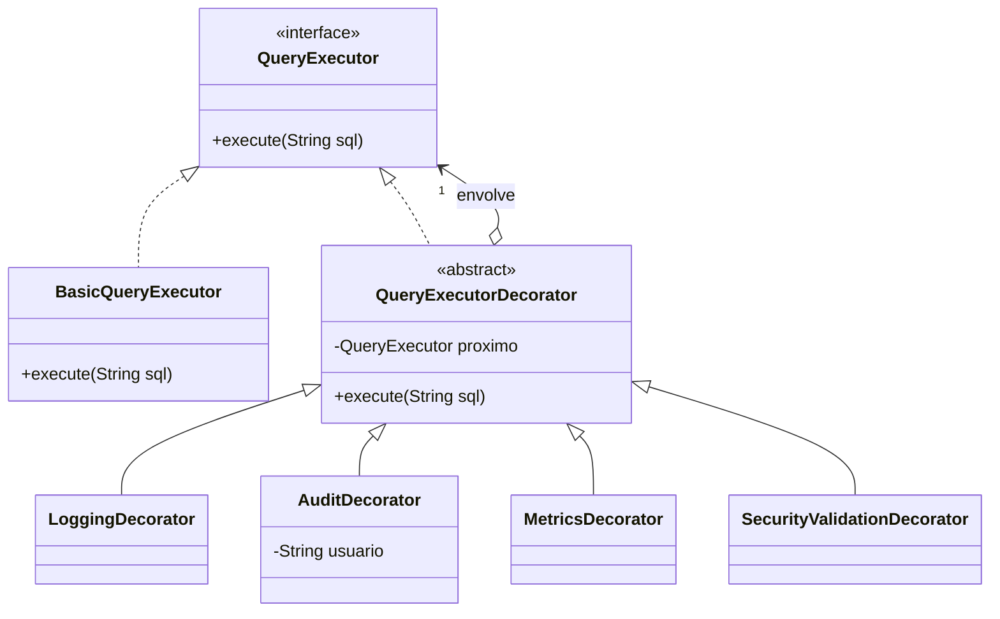

# Exercício: Decorator na execução segura de comandos SQL

> Métodos Avançados de Programação (UEPB, 2026.2) · Autor: Pedro Santos · Java 17+

Enunciado: [`enunciado.pdf`](enunciado.pdf)

## O problema

O sistema tem um executor simples, `BasicQueryExecutor`, que só manda a query para o banco. Surgiram quatro necessidades novas: **log** das tentativas, **auditoria** do usuário, **métricas** de tempo e **validação de segurança** contra comandos perigosos e SQL Injection. A exigência é acrescentar tudo isso **sem modificar a classe principal**, e de forma que os comportamentos possam ser combinados livremente.

## Por que não usar herança

Com herança, cada combinação viraria uma subclasse: `ExecutorComLog`, `ExecutorComLogEAuditoria`, `ExecutorComLogAuditoriaEMetricas`... Com 4 comportamentos opcionais, já são **15 combinações possíveis**, sem contar a ordem entre eles. Além disso, a combinação ficaria fixa no código, sem poder mudar em tempo de execução.

## A solução

Com o **Decorator**, cada comportamento é uma camada que **implementa** `QueryExecutor` e **envolve** outro `QueryExecutor`. Cada camada faz a sua parte e repassa a chamada para a próxima. Para o cliente, a cadeia inteira continua sendo apenas um `QueryExecutor`.

| Papel no Decorator | Classe |
|---|---|
| Component | `executor/QueryExecutor` |
| Concrete Component | `executor/BasicQueryExecutor` (inalterado) |
| Decorator base | `decorators/QueryExecutorDecorator` (abstrata) |
| Decorators concretos | `LoggingDecorator`, `AuditDecorator`, `MetricsDecorator`, `SecurityValidationDecorator` |



### Como a chamada atravessa as camadas

A montagem do enunciado é `Logging → Audit → Metrics → Security → Basic`. Uma query bloqueada percorre a cadeia assim:

```mermaid
sequenceDiagram
    participant Main
    participant Log as Logging
    participant Aud as Audit
    participant Met as Metrics
    participant Sec as Security
    participant Basic as BasicQueryExecutor
    Main->>Log: execute("DROP TABLE users; --")
    Log->>Log: [LOG] Tentando executar...
    Log->>Aud: execute(sql)
    Aud->>Aud: [AUDIT] Usuário responsável: luciana
    Aud->>Met: execute(sql)
    Met->>Met: inicia cronômetro
    Met->>Sec: execute(sql)
    Sec->>Sec: [SECURITY] bloqueada (DROP)
    Note over Sec,Basic: não delega: Basic nunca é chamado
    Sec-->>Met: retorna
    Met->>Met: [METRICS] Tempo de execução
```

## A ordem das camadas importa

As classes são as mesmas, mas a montagem muda o resultado (veja `app/DemonstracaoOrdem`):

- **Segurança por dentro** (montagem do enunciado): a tentativa de ataque é bloqueada **e** fica registrada no log e na auditoria. É o desejável, porque se sabe quem tentou.
- **Segurança por fora**: o ataque é bloqueado antes de chegar ao log, e não sobra rastro de quem tentou.
- **Métricas envolvendo a segurança**: o tempo medido inclui a validação. Se o `MetricsDecorator` ficasse logo acima do `Basic`, mediria só o acesso ao banco.

## Validação de segurança: decisões

- **Comandos destrutivos** (`DROP`, `DELETE`, `TRUNCATE`, `ALTER`) são procurados como **palavras inteiras** e sem diferenciar maiúsculas de minúsculas. Assim, `drop table` é bloqueado, mas uma coluna como `dropdown` ou `altered_at` não gera alarme falso.
- **Padrões de injeção** (`' OR '1'='1`, `--` e `;`) são comparados depois de remover os espaços. Variações como `' or '1' = '1` também são pegas.
- **Os comandos destrutivos são checados primeiro.** Por isso `DROP TABLE users; --` é reportado como "palavra perigosa", como no exemplo do enunciado.
- **Quando bloqueia, o decorator não chama o próximo executor:** simplesmente retorna, e o `BasicQueryExecutor` nunca recebe a query. A `Verificacao` comprova isso com um executor "espião".

### Limite importante

Uma lista de palavras proibidas é uma **camada extra**, não a defesa principal. Um atacante pode contornar a lista com outras formas (`OR 2>1`, `UNION SELECT`, codificações diferentes), e ela também pode bloquear queries legítimas. A proteção recomendada pela OWASP são as **consultas parametrizadas**, em que o dado do usuário nunca é interpretado como código SQL:

```java
// Em vez de concatenar a entrada do usuário na query:
String sql = "SELECT * FROM users WHERE name = ?";
try (PreparedStatement ps = conexao.prepareStatement(sql)) {
    ps.setString(1, nomeDigitado);   // "admin' OR '1'='1" vira apenas um texto
    ResultSet rs = ps.executeQuery();
}
```

## Diferenças em relação aos exemplos do enunciado

O enunciado traz mensagens diferentes para a mesma situação: os exemplos de cada decorator não batem com o bloco "Resultados esperados", e esse bloco não mostra as linhas de auditoria e métricas, apesar de a cadeia incluir os dois decorators. As escolhas feitas:

| Situação | Mensagem usada |
|---|---|
| Executor básico | `Query executada no banco: <sql>`: mantido igual ao código fornecido no enunciado, que não deveria ser alterado |
| Log | `[LOG] Tentando executar: <sql>`: segue os resultados esperados, que mostram a query |
| Bloqueio | `[SECURITY] Query bloqueada por validação de segurança. Motivo: <motivo>.`: junta a mensagem do item 4 com os dois motivos dos resultados esperados (palavra perigosa / possível SQL Injection) |
| Auditoria e métricas | Exatamente como nos itens 2 e 3 |

## Extras

- **`app/DemonstracaoOrdem`:** a mesma query montada em ordens diferentes, para mostrar que a ordem muda o comportamento e que cada decorator funciona sozinho.
- **`app/Verificacao`:** 18 checagens automáticas, entre elas:
  - 11 queries que devem passar ou ser bloqueadas, incluindo minúsculas, espaços extras e falsos positivos;
  - a ordem das mensagens na cadeia;
  - a garantia de que o executor básico não é chamado quando há bloqueio;
  - a recusa de construções inválidas.

## Estrutura

```
src/br/uepb/map/decorator/
├── executor/      QueryExecutor.java, BasicQueryExecutor.java
├── decorators/    QueryExecutorDecorator.java, LoggingDecorator.java, AuditDecorator.java,
│                  MetricsDecorator.java, SecurityValidationDecorator.java
└── app/           Main.java, DemonstracaoOrdem.java, Verificacao.java
```

## Como executar

Na raiz desta pasta:

```bash
javac -encoding UTF-8 -d out $(find src -name "*.java")
java -cp out br.uepb.map.decorator.app.Main
java -cp out br.uepb.map.decorator.app.DemonstracaoOrdem
java -cp out br.uepb.map.decorator.app.Verificacao
```

No PowerShell, troque a primeira linha por:

```powershell
javac -encoding UTF-8 -d out (Get-ChildItem -Recurse src -Filter *.java).FullName
```

## Saída do `Main`

O tempo (`X`) varia a cada execução.

```
[LOG] Tentando executar: SELECT * FROM users
[AUDIT] Usuário responsável: luciana
Query executada no banco: SELECT * FROM users
[METRICS] Tempo de execução: Xms

[LOG] Tentando executar: DROP TABLE users; --
[AUDIT] Usuário responsável: luciana
[SECURITY] Query bloqueada por validação de segurança. Motivo: palavra perigosa detectada (DROP).
[METRICS] Tempo de execução: Xms

[LOG] Tentando executar: SELECT * FROM users WHERE name = 'admin' OR '1'='1'
[AUDIT] Usuário responsável: luciana
[SECURITY] Query bloqueada por validação de segurança. Motivo: possível SQL Injection detectado (' OR '1'='1).
[METRICS] Tempo de execução: Xms
```

## Referências

| | | |
|:-:|:-:|:-:|
|  |  |  |
| [Padrões de Projeto](https://loja.grupoa.com.br/padroes-de-projeto-p989759) | [Use a Cabeça! Padrões de Projetos](https://altabooks.com.br/produto/use-a-cabeca-padroes-de-projetos/) | [Java Efetivo](https://altabooks.com.br/produto/java-efetivo/) |
| Gamma et al. Padrão Decorator | Freeman e Freeman. Cap. 3 (Decorator) | Bloch. Item 18 (composição e classes *wrapper*) |

- [Decorator (Refactoring.Guru)](https://refactoring.guru/pt-br/design-patterns/decorator)
- [SQL Injection Prevention Cheat Sheet (OWASP)](https://cheatsheetseries.owasp.org/cheatsheets/SQL_Injection_Prevention_Cheat_Sheet.html)
- [SQL Injection (DevMedia), indicado no enunciado](https://www.devmedia.com.br/sql-injection/6102)
